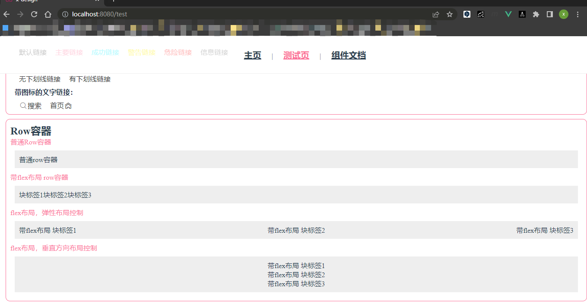
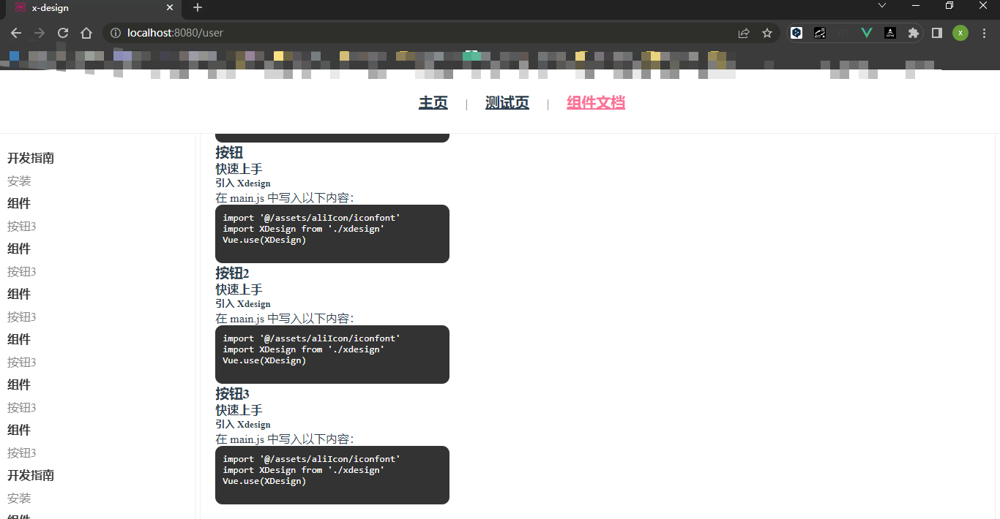
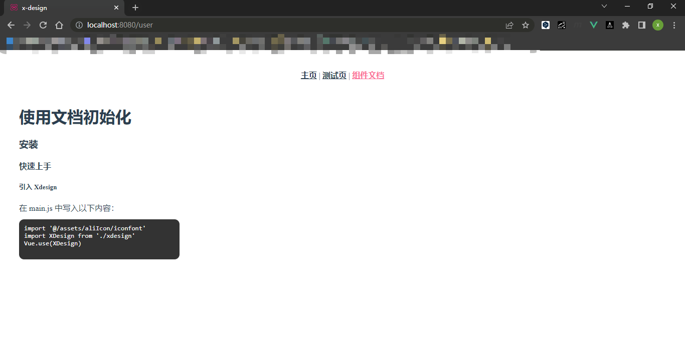
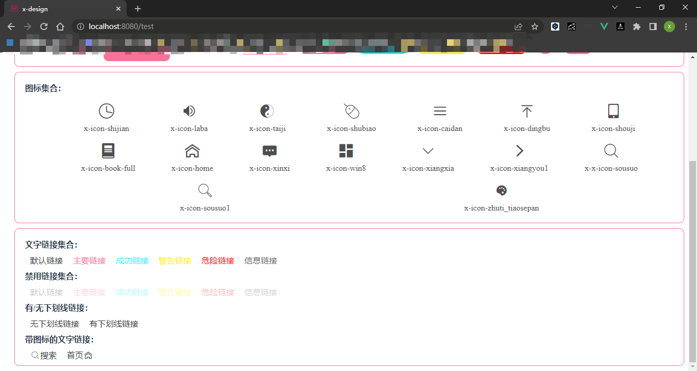
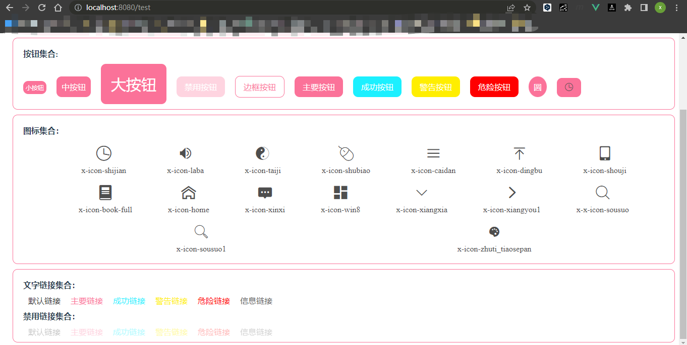
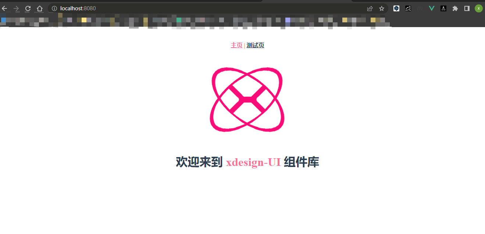
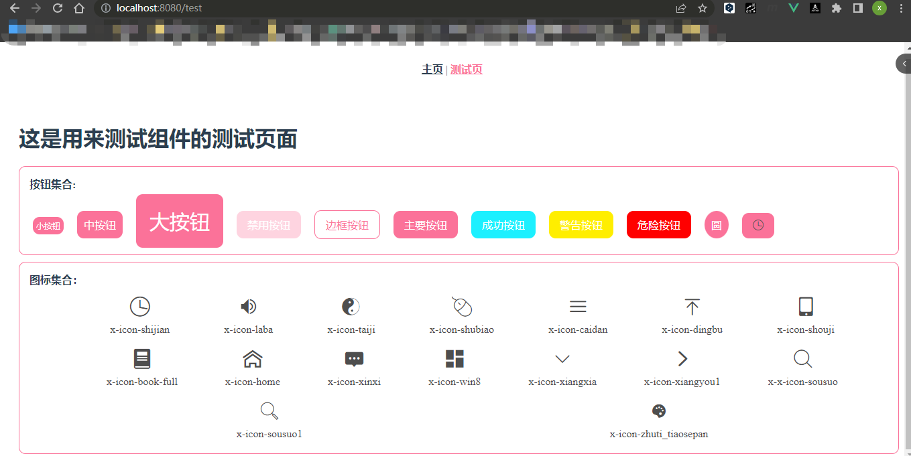
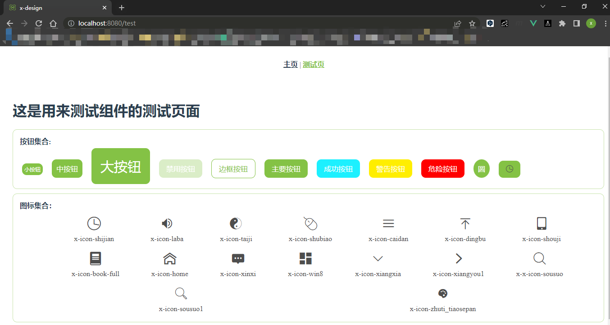
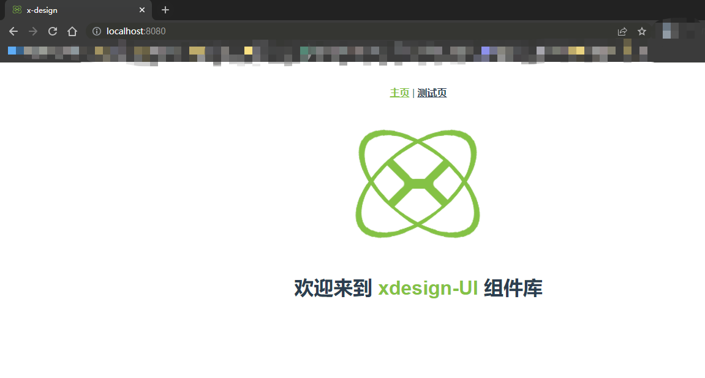

# xdesign-ui组件库日志记录
## 日志表格
|日期时间|更新内容|特别描述|
| :---: | :---: | :---: |
|2023-07-18 18：02|添加row组件，带弹性布局|带方向，位置和类型属性|
|2023-07-18 09：57|优化文档的整体结构Layout||
|2023-07-17 20：56|添加组件文档，初始化文档||
|2023-07-17 20：31|添加有无下划线链接，带图标的文字链接||
|2023-07-14 11：50|添加XLink组件||
|2023-07-14 11：00|更换主题，Vue.use功能||
|2023-07-13 20：51|添加按钮组件和ICON组件||
|2023-07-13 15：39|初始化项目||

## 日志描述
|日期时间|描述|
| :---: | :--- |
|2023-07-18 18：02|用render函数，模拟el-row，添加row组件，带弹性布局，带方向，位置和类型属性||
|2023-07-18 09：57|优化文档的整体结构Layout||
|2023-07-17 20：56|添加组件文档，初始化文档||
|2023-07-17 20：31|添加有无下划线链接，带图标的文字链接||
|2023-07-14 11：50|添加XLink组件,支持跳转，禁用，颜色和跳转方式|
|2023-07-14 11：00|更换主题，更新index文件，使用install里遍历注册和别名导出，完成Vue.use功能|
|2023-07-13 20：51|添加XButton组件和XIcon组件，模仿element-ui 使用的iconfont的字体库|
|2023-07-13 15：39|更新ico图标，logo图标，规定主体颜色，提交仓库|

## 最新效果图
- **2023-07-18 18：03**

- **2023-07-18 09：57**

- **2023-07-17 20：31**

- **2023-07-17 20：31**

- **2023-07-14 11：50**

- **2023-07-14 11：00**

- **2023-07-13 20：51**

- **2023-07-13 15：39**

